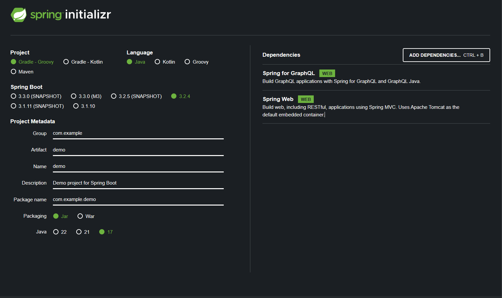
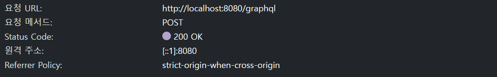
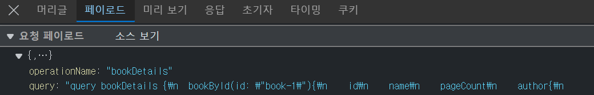
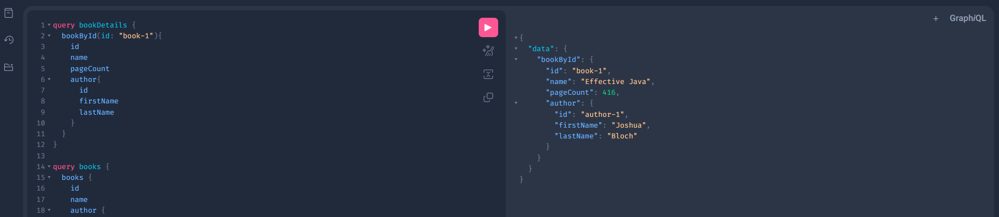
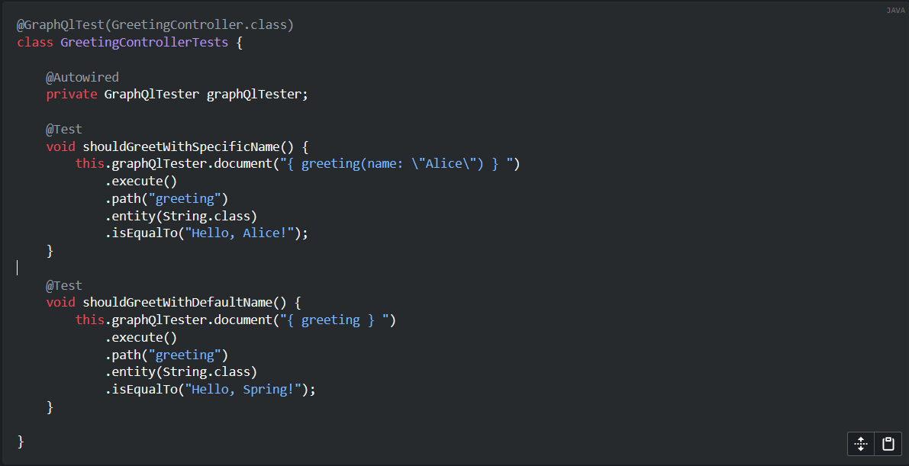

# 20-01 GraphQL - Practice

---

- GraphQL 공식 홈페이지 : [Introduction to GraphQL | GraphQL](https://graphql.org/learn/)
- GraphQL Spring 도큐먼트 링크 - [https://spring.io/guides/gs/graphql-server](https://spring.io/guides/gs/graphql-server)

**목차**

---

## **Spring Initializr 다운로드**

- 링크 : [https://start.spring.io](https://start.spring.io/)
- 필요한 Dependencies 목록
    - Spring for GraphQL
    - Spring Web

**다운로드 받을 목록 스크린샷**



## **GraphQL에 대해**

쿼리 설명

- ID가 "book-1"인 책에 대한 쿼리 수행
- 책의 경우 id, name, pageCount 및 author를 반환합니다.
- 작성자의 경우 firstName 및 lastName을 반환합니다.

```graphql
query bookDetails {
  bookById(id: "book-1") {
    id
    name
    pageCount
    author {
      firstName
      lastName
    }
  }
}
```

POST로 데이터를 요청하는 모습



페이로드 요청의 형태



**JSON으로 응답을 돌려주는 형태**

```json
{
  "bookById": {
    "id":"book-1",
    "name":"Effective Java",
    "pageCount":416,
    "author": {
      "firstName":"Joshua",
      "lastName":"Bloch"
    }
  }
}
```

**스키마 형태**

- 서버에서는 쿼리 요청시, 요청 개체 타입과, 필드(속성)을 스키마를 통해 알 수 있음
- 클라이언트 에서는 서버 서버에 스키마 세부 정보 요청이 가능

```graphql
type Query {
    bookById(id: ID): Book
}

type Book {
    id: ID
    name: String
    pageCount: Int
    author: Author
}

type Author {
    id: ID
    firstName: String
    lastName: String
}
```

## **예제 API: 도서 세부정보 가져오기**

1. GraphQL 스키마 정의
2. 쿼리에 대한 실제 데이터를 가져오는 논리를 구현합니다

특정 Book 에 대한 상세 정보를 API를 통하여 가져오도록 하겠습니다.

## **스키마 정의**

GraphQL 스키마에는 ROOT 개체가 있습니다.

하단에서 참조하는 필드는 정의한 개체로 참조하여 데이터를 반환 할 수 있습니다.

graphql 파일을 추가해 주도록 하겠습니다.

`src/main/resources/graphql` `schema.graphqls`

```graphql

type Query {
    bookById(id: ID): Book
}

type Book {
    id: ID
    name: String
    pageCount: Int
    author: Author
}

type Author {
    id: ID
    firstName: String
    lastName: String
}
```

## **데이터 원본**

### **Book 및 Author 데이터 원본 만들기**

Book 클래스와 Author 클래스를 생성해 보도록 하겠습니다.

그리고 데이터베이스와는 연동하지 않을 것이기 때문에, 내부에 List 필드를 정의해주어 임시적으로 데이터를 생성하도록 하겠습니다.

**임시데이터와 함께 Book 객체 Record로 DTO 생성.**

```java
package com.example.graphqlserver;

import java.util.Arrays;
import java.util.List;

public record Book (String id, String name, int pageCount, String authorId) {

    public static List<Book> books = Arrays.asList(
            new Book("book-1", "Effective Java", 416, "author-1"),
            new Book("book-2", "Hitchhiker's Guide to the Galaxy", 208, "author-2"),
            new Book("book-3", "Down Under", 436, "author-3")
    );

    public static Book getById(String id) {
        return books.stream()
				.filter(book -> book.id().equals(id))
				.findFirst()
				.orElse(null);
    }
}
```

**임시데이터와 함께 Author 객체 Record로 DTO 생성.**

```java
package com.example.graphqlserver;

import java.util.Arrays;
import java.util.List;

public record Author (String id, String firstName, String lastName) {

    public static List<Author> authors = Arrays.asList(
            new Author("author-1", "Joshua", "Bloch"),
            new Author("author-2", "Douglas", "Adams"),
            new Author("author-3", "Bill", "Bryson")
    );

    public static Author getById(String id) {
        return authors.stream()
				.filter(author -> author.id().equals(id))
				.findFirst()
				.orElse(null);
    }
}
```

## 컨트롤러 생성

Spring for GraphQL은  [어노테이션](https://docs.spring.io/spring-graphql/reference/controllers.html) 기능을 제공합니다.

컨트롤러 어노테이션을 사용해서, 원하는 GrphQl 필드의 데이터를 가져오도록 할 수 있습니다.

```java
package com.example.graphqlserver;

import org.springframework.graphql.data.method.annotation.Argument;
import org.springframework.graphql.data.method.annotation.QueryMapping;
import org.springframework.graphql.data.method.annotation.SchemaMapping;
import org.springframework.stereotype.Controller;

@Controller
public class BookController {
    @QueryMapping
    public Book bookById(@Argument String id) {
        return Book.getById(id);
    }

    @SchemaMapping
    public Author author(Book book) {
        return Author.getById(book.authorId());
    }
}
```

## 어노테이션 설명


### **@QueryMapping**

**`@QueryMapping`** 어노테이션은 메서드가 GraphQL 쿼리 요청을 처리하는 엔드포인트임을 나타냅니다. 메서드 이름을 기반으로 하거나, 어노테이션의 **`name`** 속성을 사용하여 쿼리의 이름을 명시적으로 지정할 수 있습니다.

```java

@QueryMapping
public Book bookById(@Argument String id) {
    return Book.getById(id);
}

```

위 예제에서 **`bookById`** 메서드는 **`bookById`** 쿼리 요청을 처리하며, 쿼리로부터 전달된 **`id`** 값을 파라미터로 받아 처리합니다.

### **@Argument**

**`@Argument`** 어노테이션은 메서드의 파라미터가 GraphQL 쿼리 또는 뮤테이션에서 전달된 인자임을 나타냅니다.

이를 통해 쿼리로부터 전달된 인자를 쉽게 메서드 내에서 사용할 수 있습니다.

```java

public Book bookById(@Argument String id) {
    // 메서드 구현...
}

```

이 경우, 클라이언트는 **`id`** 인자를 포함하는 **`bookById`** 쿼리를 서버에 전송하며, 해당 **`id`** 값은 메서드의 **`id`** 파라미터로 전달됩니다.

### **@SchemaMapping**

**`@SchemaMapping`** 어노테이션은 메서드를 GraphQL 스키마의 특정 타입이나 필드에 매핑합니다.

```java
@SchemaMapping
public Author author(Book book) {
    return Author.getById(book.authorId());
}

//********************************************************************//
// 아래 코드 처럼 typeName,field를 지정하여 명시적으로 표현이 가능합니다.
//********************************************************************//

@SchemaMapping(typeName = "Book", field = "author")
public Author getAuthor(Book book) {
     Book // 객체에서 저자 ID를 사용하여 Author 조회 
}

```

**`@SchemaMapping` 어노테이션의 `typeName`과 `field` 속성에서 대소문자 구분**

GraphQL 스키마는 기본적으로 대소문자를 구분하는 언어이기 때문에, 스키마 정의 시 사용한 타입 이름과 필드 이름의 대소문자를 정확히 일치시켜야 합니다.

예를 들어, 스키마에서 **`Book`** 타입과 그 내부의 **`author`** 필드를 다음과 같이 정의했다고 가정해 보겠습니다:

```graphql

type Book {
    id: ID
    name: String
    pageCount: Int
    author: Author
}

```

이 경우, **`Book`** 타입의 **`author`** 필드를 해결하기 위한 **`@SchemaMapping`** 어노테이션은 다음과 같이 적용해야 합니다

```text

@SchemaMapping(typeName = "Book", field = "author")

```

**`typeName`**의 값으로 **`"Book"`**을, **`field`**의 값으로 **`"author"`**를 사용했습니다.

이때, **`"Book"`**과 **`"author"`** 모두 스키마에서 정의한 대로 정확한 대소문자를 사용해야 합니다.

GraphQL 에 관련한 어노테이션 설명 공식링크를 남겨놓겠습니다.

[Annotated Controllers :: Spring GraphQL](https://docs.spring.io/spring-graphql/reference/controllers.html)

## **첫 번째 쿼리 실행**

### **GraphiQL 플레이그라운드 활성화 하기**

GraphiQL은 쿼리 작성 및 실행 등을 위한 유용한 시각적 인터페이스입니다.

이 구성을 파일에 추가하여 GraphiQL을 활성화합니다.

application.properties

```properties
spring.graphql.graphiql.enabled=true
```

application.yaml

```yaml
spring:
  graphql:
    graphiql:
      enabled: 'true'
```

### 앱 시작

- Spring 애플리케이션을 시작합니다.
- [http://localhost:8080/graphiql](http://localhost:8080/graphiql) 로 이동합니다.

### **쿼리 실행**

검색 쿼리를 요청해 보도록 하곘습니다.

아래 내용을 입력 후 재생 버튼을 클릭합니다.

```graphql
query bookDetails {
  bookById(id: "book-1") {
    id
    name
    pageCount
    author {
      id
      firstName
      lastName
    }
  }
}
```

요청한 데이터가 잘 반환 되는 모습.



### **테스트**

스프링 GraphQL 테스트 공식문서

- [Spring for GraphQL 테스트 공식문서](https://docs.spring.io/spring-graphql/reference/testing.html)
- [GraphQL 테스트용 Spring 자동구성](https://docs.spring.io/spring-boot/docs/current/reference/html/features.html#features.testing.spring-boot-applications.spring-graphql-tests)



### BookDetails 쿼리를 예시로한 테스트코드 작성.

GraphiQL 플레이그라운드에서 요청한 것과 동일한 쿼리를 확인하는 테스트코드를 작성해 보겠습니다.

테스트 파일생성

`src/test/java/com/example/graphqlserver/` `BookControllerTests.java`

```java
package com.example.graphqlserver;

import org.junit.jupiter.api.Test;
import org.springframework.beans.factory.annotation.Autowired;
import org.springframework.boot.test.autoconfigure.graphql.GraphQlTest;
import org.springframework.graphql.test.tester.GraphQlTester;

@GraphQlTest(BookController.class)
public class BookControllerTests {

    @Autowired
    private GraphQlTester graphQlTester;

    @Test
    void shouldGetFirstBook() {
        this.graphQlTester
				.documentName("bookDetails")
				.variable("id", "book-1")
                .execute()
                .path("bookById")
                .matchesJson("""
                    {
                        "id": "book-1",
                        "name": "Effective Java",
                        "pageCount": 416,
                        "author": {
                          "firstName": "Joshua",
                          "lastName": "Bloch"
                        }
                    }
                """);
    }
}
```

재사용할 수 있도록 매개 변수화됩니다.

`src/test/resources/graphql-test/` `bookDetails.graphql`

```graphql
query bookDetails($id: ID) {
    bookById(id: $id) {
        id
        name
        pageCount
        author {
            id
            firstName
            lastName
        }
    }
}
```

테스트를 실행하고 결과가 GraphiQL 플레이그라운드에서 수동으로 요청한 GraphQL 쿼리와 동일한지 확인합니다.

## **추가 참고 자료**

---

-
- 공식 소스 코드: 깃허브 링크   [GitHub](https://github.com/spring-guides/gs-graphql-server).
- 스프링 공식 설명서 :  [Spring for GraphQL](https://docs.spring.io/spring-graphql/reference/)
- GraphQL-java : GraphQL용 Spring을 지원하는 엔진 - [GraphQL Java 설명서](https://www.graphql-java.com/documentation/getting-started)

**GraphQL 예제 사이트**

```bash
git clone [https://github.com/spring-guides/gs-graphql-server.git](https://github.com/spring-guides/gs-graphql-server.git)
```